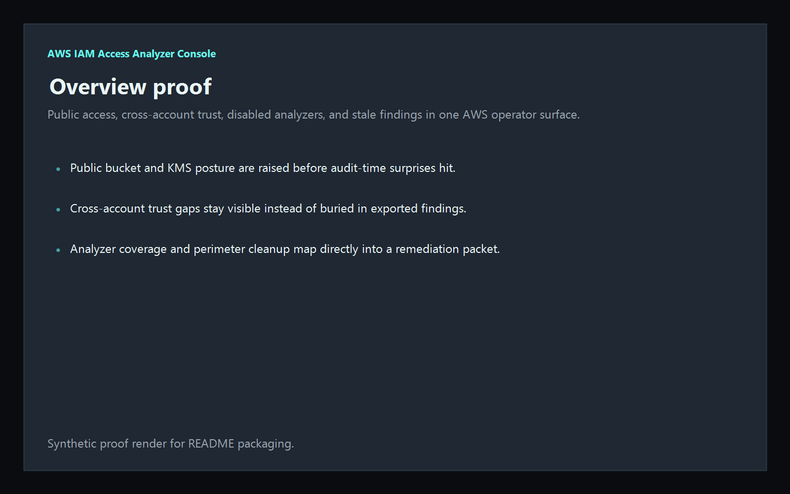
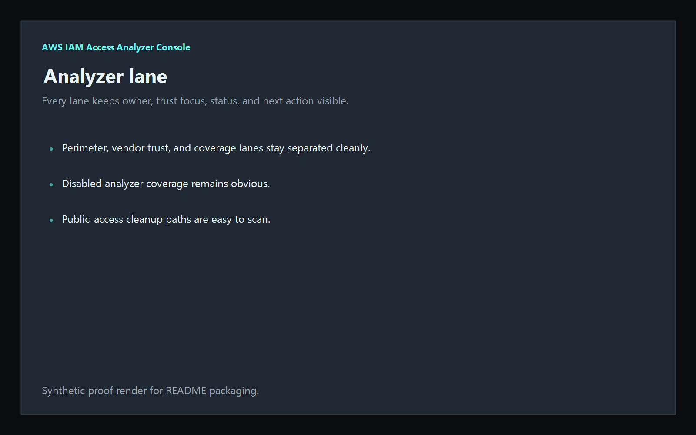
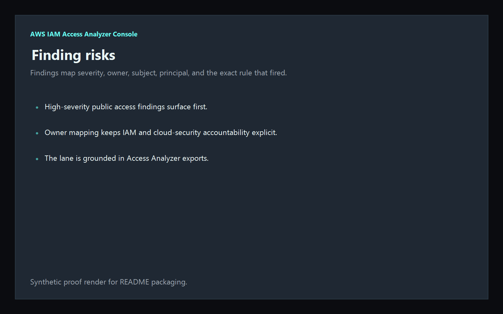
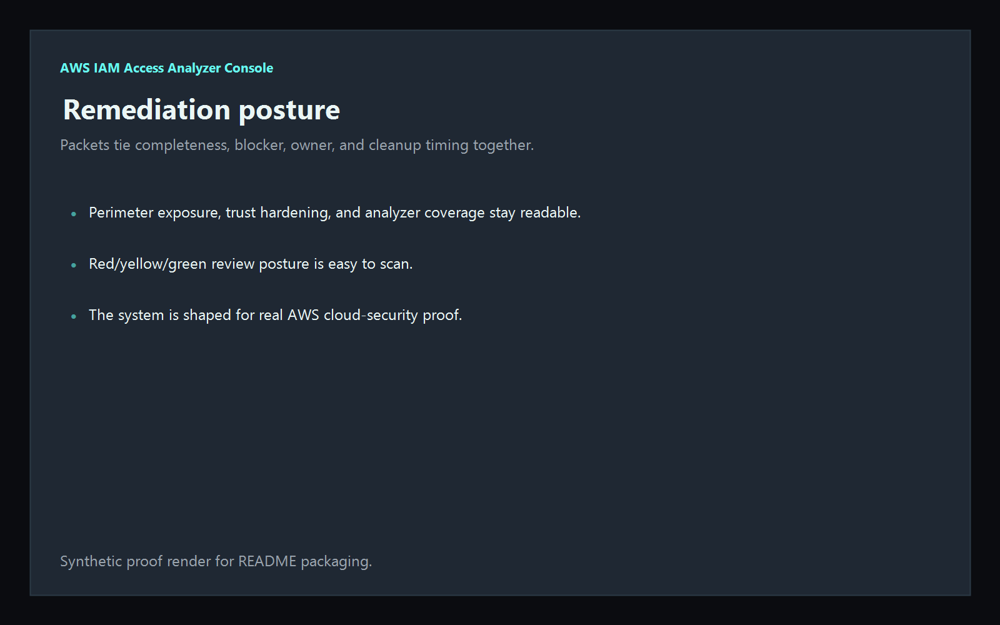

# aws-iam-access-analyzer-console

[](https://github.com/mizcausevic-dev/aws-iam-access-analyzer-console/actions/workflows/ci.yml)
[](./LICENSE)
[](https://github.com/mizcausevic-dev/aws-iam-access-analyzer-console/actions/workflows/pages.yml)

Operator control plane for AWS IAM Access Analyzer findings, public-access posture, cross-account trust risk, stale active findings, and remediation sequencing.

## Why this exists

- Access Analyzer exports become dangerous when they stay trapped in raw JSON instead of one operator-readable surface.
- Public access, cross-account trust, and analyzer coverage need to stay visible together before audits, incidents, or rollout windows drift.
- Recruiters looking for `AWS / IAM / Access Analyzer / cloud security` proof should see a real identity-and-perimeter dashboard, not a keyword page.
- This repo turns Access Analyzer data into a control plane for public resources, external trust, stale findings, and disabled analyzer coverage.

## Why this matters (KG Embedded tie-back)

This repo demonstrates the AWS identity-and-perimeter control-plane primitive for cloud operations: public access, cross-account trust, analyzer coverage, and remediation packets in one operator surface. Kinetic Gain Embedded extends this pattern into productized in-app dashboards where platform, IAM, and security teams need evidence-rich surfaces without exposing raw admin backends or cloud credentials. See [kineticgain.com/embedded](https://kineticgain.com/embedded).

## What it shows

- analyzer-lane visibility for active and disabled analyzers, trust paths, and public perimeter issues in one dashboard
- finding-risk detection for public S3/KMS posture, cross-account IAM role trust, stale active findings, and missing trust conditions
- remediation packets for perimeter cleanup, vendor trust hardening, and secondary-region analyzer coverage
- offline-safe analysis of captured AWS IAM Access Analyzer exports
- recruiter-facing AWS IAM / cloud security proof that complements the Microsoft admin lane

## Routes

- `/`
- `/analyzer-lane`
- `/finding-risks`
- `/remediation-posture`
- `/verification`
- `/docs`

## API

- `/api/dashboard/summary`
- `/api/analyzer-lane`
- `/api/finding-risks`
- `/api/remediation-posture`
- `/api/verification`
- `/api/sample`

## Screenshots






## CLI

```powershell
npx aws-iam-access-analyzer fixtures/access-analyzer.json `
    --format json|markdown|summary `
    --now 2026-05-30T00:00:00Z `
    --stale-finding-after-days 30 `
    --fail-on-high `
    --out report.md
```

Input shape:

```json
{
  "analyzers": [ ... ],
  "findings": [ ... ]
}
```

## Local Development

```powershell
cd aws-iam-access-analyzer-console
npm install
npm run dev
```

Open:
- [http://127.0.0.1:5514/](http://127.0.0.1:5514/)
- [http://127.0.0.1:5514/analyzer-lane](http://127.0.0.1:5514/analyzer-lane)
- [http://127.0.0.1:5514/finding-risks](http://127.0.0.1:5514/finding-risks)
- [http://127.0.0.1:5514/remediation-posture](http://127.0.0.1:5514/remediation-posture)
- [http://127.0.0.1:5514/verification](http://127.0.0.1:5514/verification)

## Validation

- `npm run lint`
- `npm run typecheck`
- `npm run coverage`
- `npm run build`
- `npm run demo`
- `npm run smoke`
- `npm run prerender`
- `npm run render:assets`

## Production status

| Aspect | Status |
|--------|--------|
| CI | Node 20 + 22 matrix — lint · typecheck · coverage · build · demo · smoke · prerender · `npm audit` |
| License | [AGPL-3.0-or-later](./LICENSE) |
| Deploy | Static prerender -> **https://aws.kineticgain.com/** |
| Data posture | Synthetic sample data only; no live AWS credentials, account tokens, or production analyzer exports |
| Suite | Part of the [Kinetic Gain Protocol Suite](https://suite.kineticgain.com/) operator portfolio · apex: [kineticgain.com](https://kineticgain.com) |

## Docs

- [Kinetic Gain Embedded tie-back](./docs/KINETIC_GAIN_EMBEDDED.md)
- [Changelog](./CHANGELOG.md)

## Composes with

- [**`entra-access-review-control-plane`**](https://github.com/mizcausevic-dev/entra-access-review-control-plane) — Microsoft Entra access reviews
- [**`intune-device-compliance-ops`**](https://github.com/mizcausevic-dev/intune-device-compliance-ops) — Intune device compliance

Together they form a broader recruiter-facing cloud admin lane: Microsoft tenant governance plus AWS identity and perimeter proof.
